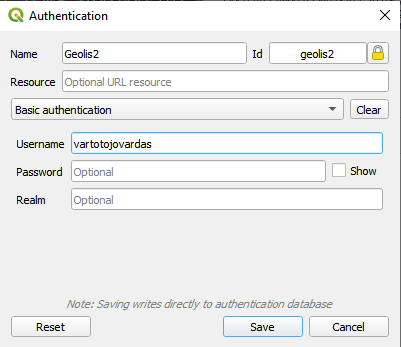

Naudojami du qgis projektai
1. LGT.qgz, skirtas visai sluoksnių logikai aprašyti,
1. QGIS.qgz, skirtas sluoksniam visiems pasiekiamoje vietoje įkelto LGT.qgz paimti, taip kad kažką pakeitus LGT.qgz atsinaujintų ir per QGIS.qgz projektą matomi duomenys.
    * Sukonfigūruotas taip, kad LGT.qgz įkeltas į  `\\granitas\visi_gis\visi_gis\QGIS\LGT.qgz`.

#### QGIS Konfigūracija
Prieš redaguojant LGT.qgz būtina susikonfigūruoti  QGIS Autentifikaciją su `Id=geolis2`
  
To nepadarius projekte išsisaugo nešifruotas oracle vartotojo vardas ir slaptažodis.

Tokią pat konfigūraciją reiktų padaryti ir QGIS.qgz naudotojui.

